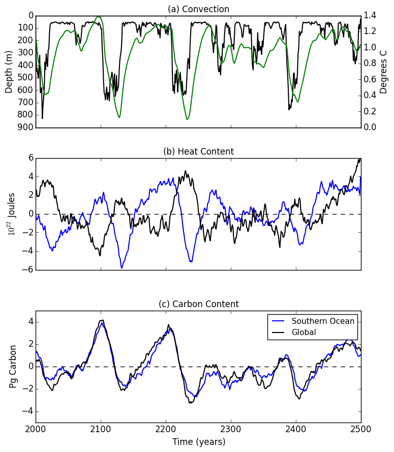
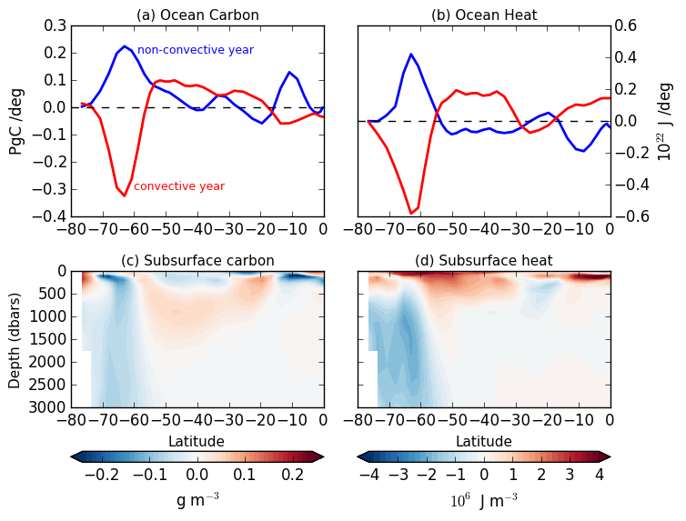

## October 27, 2015

Analysis and figures for AGU Ocean Sciences 2016 Poster: 

### *Ocean carbon and heat uptake in response to an ozone perturbation*

Ocean carbon and heat uptake play a critical role in regulating global climate. Many things are expected to affect this uptake including global warming and natural variability. Additionally, several recent studies have suggested that ozone depletion has altered Southern Ocean circulation-and thus ocean carbon and heat uptake; however, the mechanisms by which this happens are still unclear.
To understand this ocean heat and carbon uptake in response to an ozone hole, we use output from GFDL ESM2Mc, a coarse resolution Earth system model. First the natural-unforced variability in ocean carbon and heat uptake is quantified through analyzing a 500-year pre-industrial control run. This allows us to quantify the background state, natural variability, and determine which processes are important for carbon and heat uptake. Next, we analyze an ensemble of coupled model simulations that are forced with a step-function ozone perturbation. These ozone-perturbation runs are used to isolate the transient response of carbon and heat uptake to an ozone hole. This response to the ozone perturbation is then compared with the natural variability of the control run to determine the effect of the ozone perturbation on ocean carbon and heat uptake and storage.

Figure 1: Annual averaged (a) Weddell Sea convection, (b) heat content anomoly, and (c) carbon content anomoly in ESM2Mc. For carbon and heat content, blue line indicates Southern Ocean content, while the black line inticates global content. For convection, the black line corresponds to the Weddell Sea averaged mixed layer depth, and the green line corresponds to the Weddell Sea average temperature between 1500m-2300m. Figure generated Feb 9, 2015 using *proposal_figure2.py*

Figure 2: Annual averaged vertically and zonally integrated (a) ocean carbon, and (b) ocean heat for convective (blue) and non-convective (red) years. Zonally averaged difference between the convective and non-convective years for (c) carbon and (d) heat. Figure generated Feb 9, 2015 using *proposal_figure3.py*

