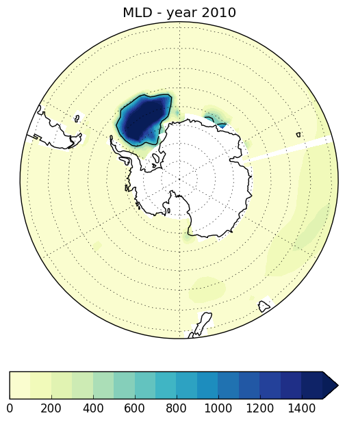

## October 27, 2015

Analysis and figures for AGU Ocean Sciences 2016 Poster: 

### Ocean carbon and heat uptake in response to an ozone perturbation

Figure 2: Timeseries of mixed layer depth (m) averaged over each region.  

\  
\  

Weddell Sea Convection | Ross Sea Convection
:-------------------------:|:-------------------------:
 | 

Figure 3: Mixed layer depth for Weddell Sea convective year (2010) and Ross Sea convective year (2045). Black countour line indicates mld = 600m.

\  
\  

