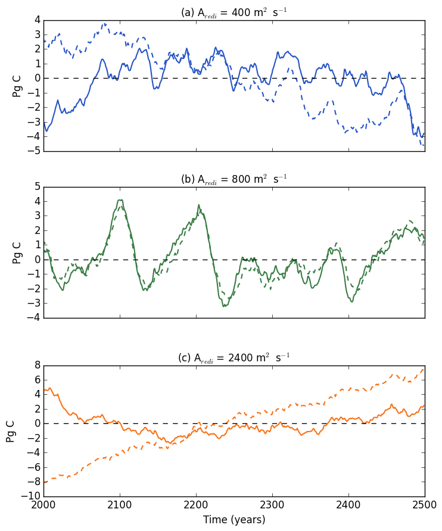

# March 22, 2016

Today:
* Calculated OCC for aredi simulations
* Made plot of global and southern ocean heat content for aredi simulations

Note: Aredi = 800 mixing case has a drift in the global carbon content (model was not spun up long enough). This drift has been removed in the Aredi = 800 mixing case. Additionally, the drift slope on the 800 case has been subtracted from the 400 and 2400 simulations. 

Raw Data                |  Detrended 400 and 2400 
:-------------------------:|:-------------------------:
  |  
