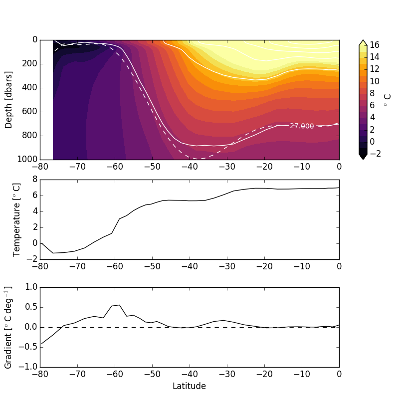

# March 24, 2016

Today:
* Interpolated temperature onto isopycnal surface ($\sigma_{0}$ = 27.00) for Aredi = 800 climatology. 
* Took gradient of temperature to obtain temperature gradient on isopycnal surface

Method: 
1. Interpolate using quintic interpolation to find the depth of the isopycnal surface. 
2. Interpolate using linaer interpolation the temperature at each depth of the isopycnal surface. 

Note: Using a linear interpolation for both steps yeilded an artifical temperature decrease at ~55S. This method allows for constant temperature increase from the Southern Ocean equatorward. 

This analysis can be done for other fields (salinity, DIC, ect.) or for other Aredi simulations.

