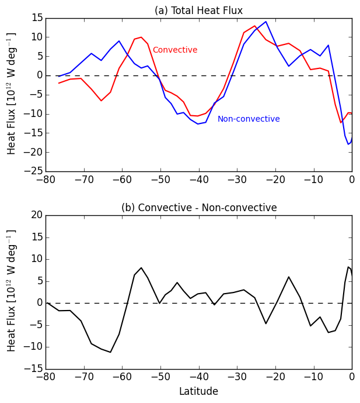

# March 28, 2016

Today:
* Calculated the fluxes of heat into/out of the surface ocean

Where:   
Q_sw = Shortwave heat flux  
Q_lw = Longwave heat flux  
Q_s = Sensible heat flux  
Q_l = Latent heat flux   
Q_v = Advective Heat flux  

Note: In this preliminary analysis, advective heat flux is ignored. 

Individual Fluxes                | Total Flux
:-------------------------:|:-------------------------:
  |  

South of 60S, negative heat flux indicates heat is removed from the ocean during convective event. Largest responsible terms are latent and longwave flux (with small contribution due to sensible heat flux). Between 25S - 60S, positive flux indicates heat is added to ocean. The responsible terms are dependent on latitude. 

