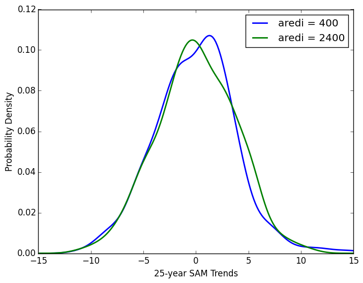

# June 30, 2015

Today: 
* Created seasonal average timeseries netcdf files for SAM using the aredi = 400, 2400 control jhu-gfdl model runs 
(/home/jthom143/data/derived). 
* Created individual netcdf timeseries files for atmospheric and ocean variables (/home/jthom143/data). 
  * surface pressure 
  * zonal wind 
  * zonal wind stress 
  * sea surface temperature
  * sea surface salinity
  * potential temperature
  * salinity
  * mixed layer depth defined by sigma-t
  * mixed layer depth defined by mixing-scheme
* Plotted SAM time-series for aredi = 400 and 2400. 
* Plotted 25-year SAM trend PDFs for aredi = 400 and 2400. 

 
