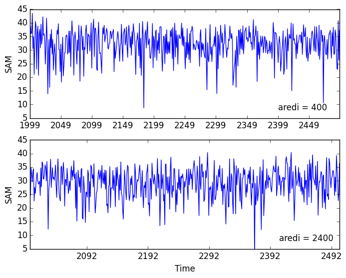

# June 30, 2015

Today: 
* Created seasonal average timeseries netcdf files for SAM using the aredi = 400, 2400 control jhu-gfdl model runs 
(/home/jthom143/data/derived). 
* Created individual netcdf timeseries files for atmospheric and ocean variables (/home/jthom143/data). 
  * surface pressure 
  * zonal wind 
  * zonal wind stress 
  * sea surface temperature
  * sea surface salinity
  * potential temperature
  * salinity
  * mixed layer depth defined by sigma-t
  * mixed layer depth defined by mixing-scheme
* Plotted SAM time-series for aredi = 400 and 2400. 
* Plotted 25-year SAM trend PDFs for aredi = 400 and 2400. 

Average for the SAM in the aredi = 400 case looks slightly higher than the aredi = 2400 case. Should calculate tomorrow. 

Extent of variability looks very similar between the two mixing cases, but it looks like the aredi = 400 case has a slight positive trend bias. Make the whisker plots tomorrow. 

 To do 07-02-2015: 
 1. Calculate mean SAM over entire period and last few hundred years. 
 2. Create whisker plots for the two mixing cases. 
 3. Do same analysis with the 50-70S average SST
