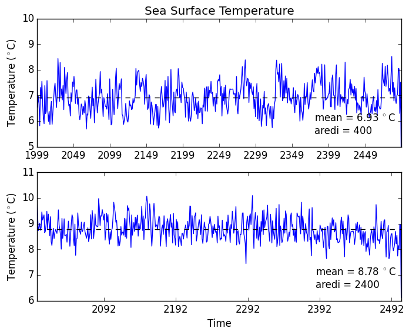

# July 6, 2015

Today: 
* Created 50-70S SST average timeseries. 
* Calculated SST 25-year trends. 

## Comparison of SAM Trends with SST Trends: 

SAM Trends                 |  SST Trends
:-------------------------:|:-------------------------:
  |  
