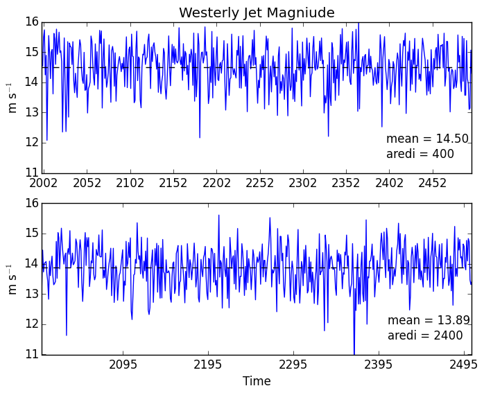
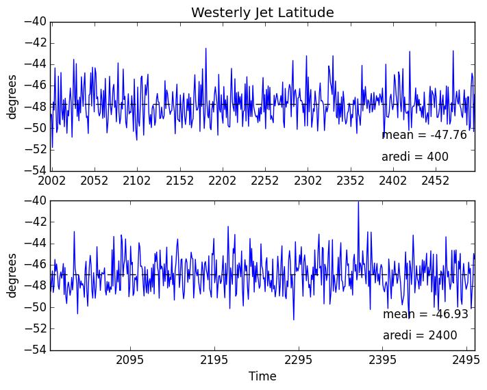

# July 8, 2015

Today: 
* Finished trend analysis for 850 mb jet magnitude and location. 
* Compared trend analysis between variables: SAM, SSTs, and westerly jet

### Trend Analysis Comparison: 

SAM Trends                 |  SST Trends
:-------------------------:|:-------------------------:
  |  
**Jet Magnitude Trends**       | **Jet Location Trends**
|

### Results: 
* Trend PDFs are similar for both mixing cases for the SAM and westerly jet metrics, but not for SSTs. 
* SST variability under the high mixing case is much smaller than the low mixing case. 
* Suggests the changes going on in the ocean in these different mixing cases is not changing the atmospheric dynamics substantially. 
* Look further in ocean fields including stratification. 
