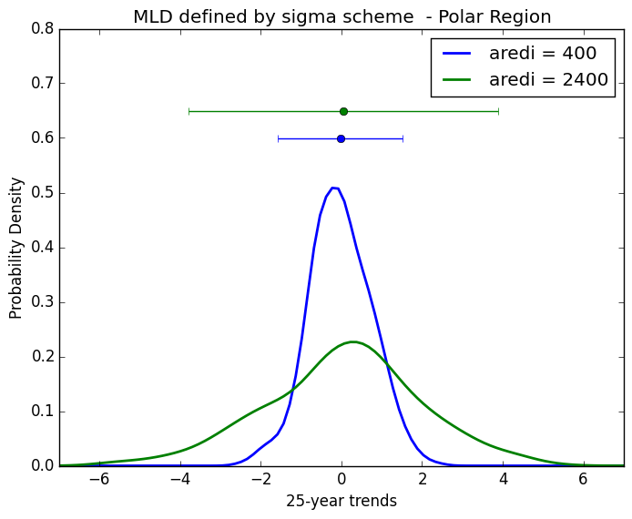
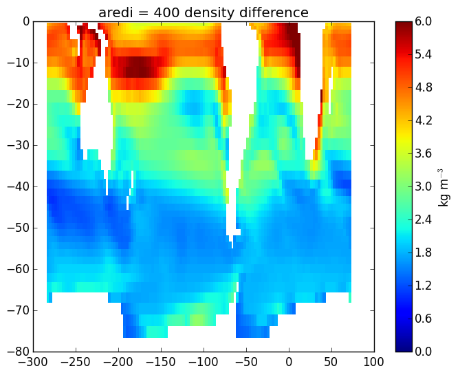

# July 14, 2015

To do today: 
* Trend anaysis for mld metrics
* Use salinity and temperature to calculate density using equation of 
state. 
* Calculate 200m surface density difference over entire Southern 
Hemisphere. 
* Focus on zonally average mid-latitude and polar band and create 
stratification timeseries. 
* Trend analysis on stratification metric. 

### Mixed Layer Depth defined using mixing scheme
aredi = 400    |  aredi = 2400 
:-------------------------:|:-------------------------:
  |  

Mid-Latitude (30-50S)     |  Polar Region (50-70S)
:-------------------------:|:-------------------------:
  |  

### Mixed Layer Depth defined using sigma-t
aredi = 400    |  aredi = 2400
:-------------------------:|:-------------------------:
  |  

Mid-Latitude (30-50S)     |  Polar Region (50-70S)
:-------------------------:|:-------------------------:
  |  

## Density Stratification
* Following Capotondi et al., 2012, calculated the density stratification as the density difference between 200 m and the surface. 
* Since density is on a pressure grid in the model output, used the 210 dbar level instead of 200m. 

DJF Density stratification averaged over the last 100 years: 

aredi = 400    |  aredi = 2400
:-------------------------:|:-------------------------:
  |  

Mid-Latitude (30-50S)     |  Polar Region (50-70S)
:-------------------------:|:-------------------------:
  |  
