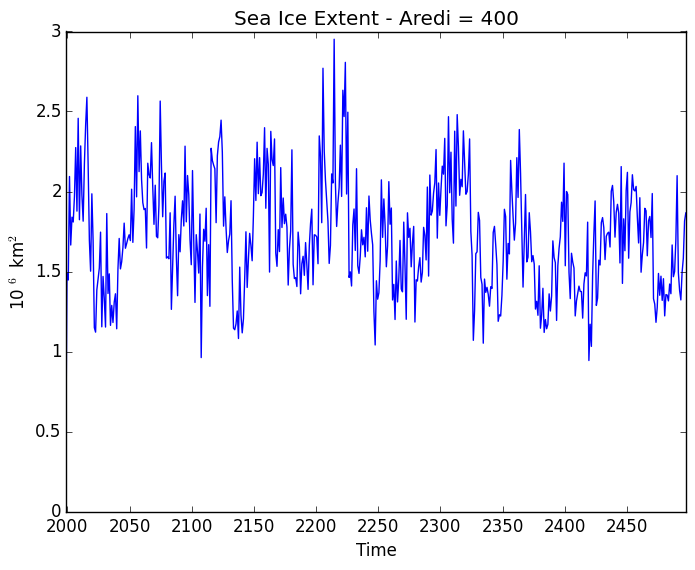

# July 16, 2016

Today: 
* Extract fractional sea ice variable from atmosphere_month.nc files
* Calculate sea ice extent (km^2)
* Plot Timeseries
* Calculate and plot 25-year trends for both mixing cases

![aredi = 2400 SIE] (files/cntrl_SIE_2400_djf_timeseries_07162015.png)
