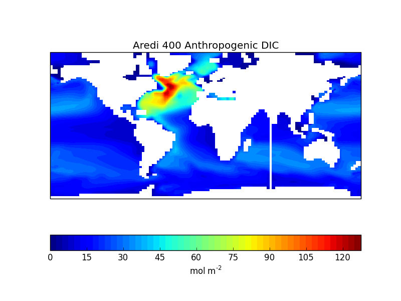
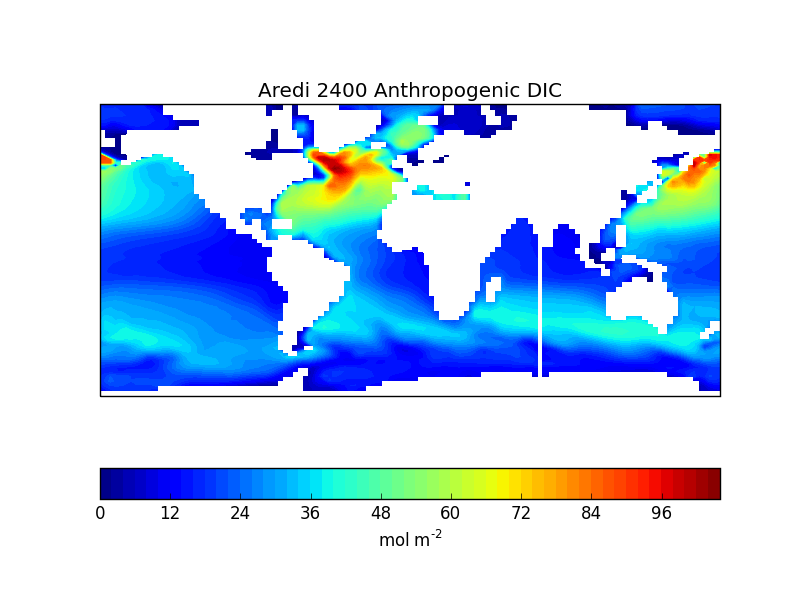
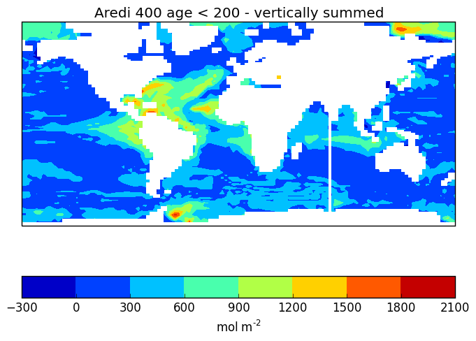
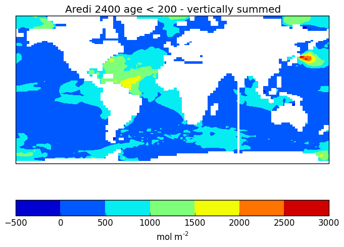

# July 31, 2015

Currently working on recreating figures 3a and c from Gnanadesidan, 2015: 

Also want to compare the age (residency_age_surface) that's younger than 200 years with the Anthropogenic DIC. 
* If the changes between the two mixing cases is due solely to ventilation rates, than the age < 200 years 
should correlate well with the DIC differences. 

 
 

