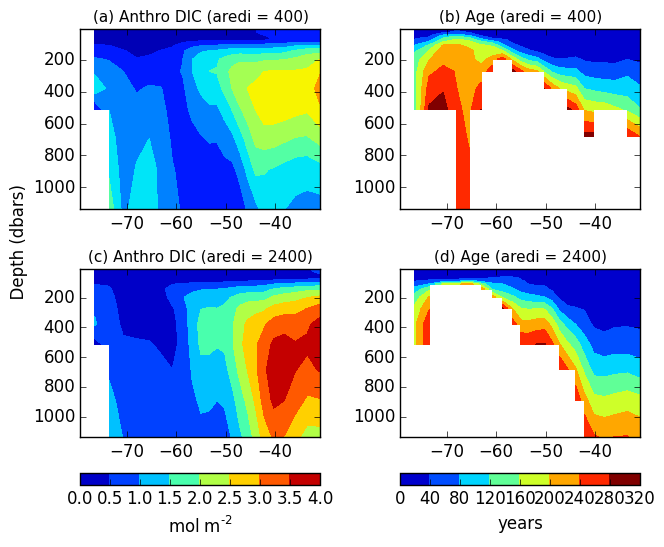
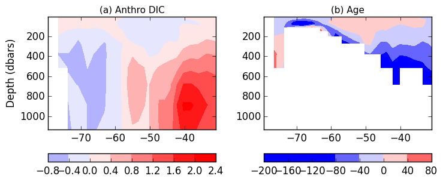

# August 3, 2015

Looking at similarities between anthropogenic DIC and age in two mixing cases (aredi = 400 and 2400) in the GFDL ESM2Mc model. 

Picked one region to focus on: Weddell sea (-45 W):

Where the age is the age less than 300 years. 

I then took the difference between the two mixing cases (aredi2400 - aredi400): 

Anand suggests looking at the zonal integral of both anthropogenic DIC and age to compare. 
