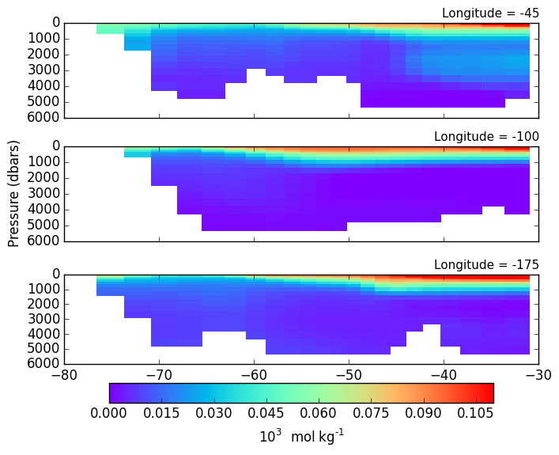
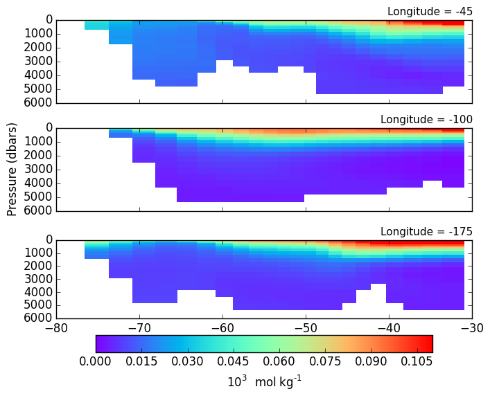
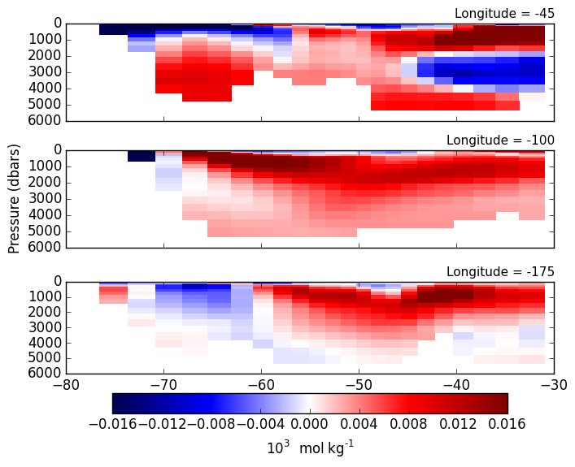

# August 7, 2015

Met with Anand to get feedback on work. He suggested looking at the time-series of 
anthropogenic DIC in the two different mixing cases (aredi = 400 & 2400) in the 
Doubling CO2 runs and taking the deriative to get the transit time distributions. 

Time-averaged aredi=400 anthropogenic DIC from Doubling CO2 Run: 

Time-averaged aredi=2400 anthropogenic DIC from Doubling CO2 Run: 

Difference between aredi=2400 and aredi=400 anthropogenic DIC: 

Tomorrow: 
* Look at the same profiles, but for the last year instead of the time average, 
since the time average. 
* Pick out one or two regions to do the time-series for. 
* Plot the time-series for both mixing cases. 
* Take the derivative of the time-series to get the transit time distribution. 
