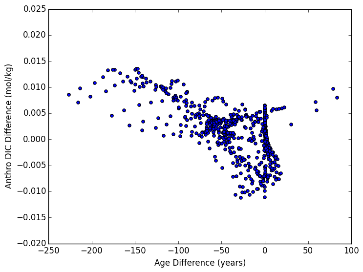

# August 20, 2015

Look at the anthropogenic DIC for two mixing cases (aredi = 400 and aredi = 2400) in multiple locations in the Southern Ocean 

Anthropogenic DIC      | Age
:---------------------------:|:-----------------------:
 |![] (files/DoublingCO2_age_zonalavg_contour_08202015.png)

## Time-series and differentiated time-series for three locations: 

High Latitude Surface: | Mid latitude at 500dbars | Mid latitude at 900dbars
:--------------------:|:-------------------------:|:------------------------:
||
||
Average age: 229, 128 years  | Average age: 265, 269 years  |Average age: 498, 317 years

* Average age for aredi = 400 and aredi = 2400 respectively

## Scatter Plots of age difference and anthro DIC difference: 

Scatter plot of entire S.O.      | Scatter plot of areas where mean age < 200 years
:---------------------------:|:-----------------------:
 |![] (files/DoublingCO2_anthroDIC_age_difference_corr_lessthan200_08202015.png)
* Note unites on y-axis are the same for both... forgot the 10^-3 on the figure to the left. 
