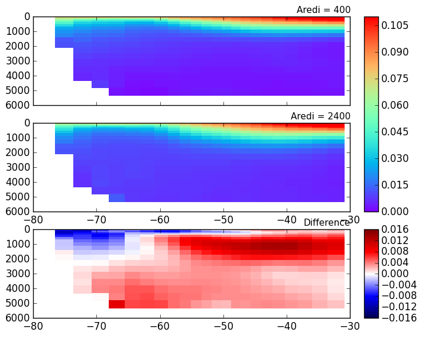
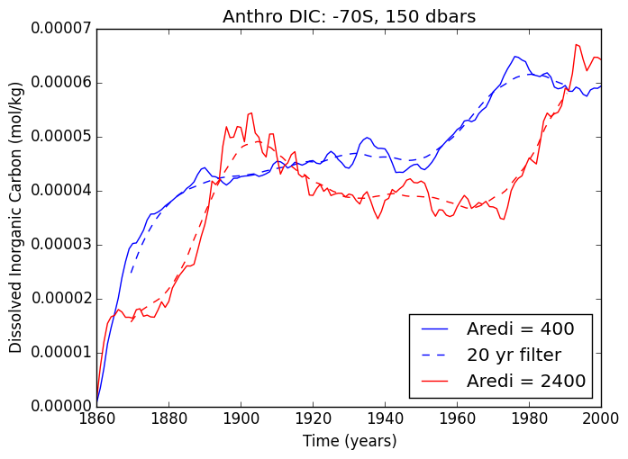
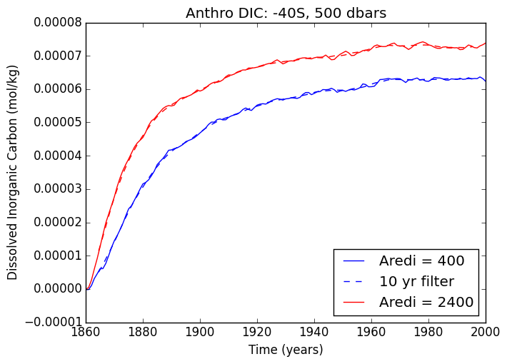
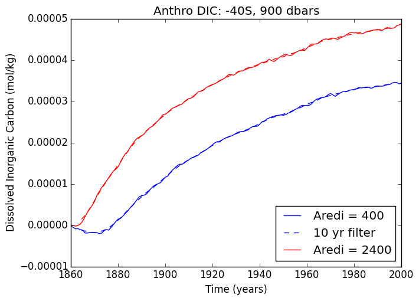
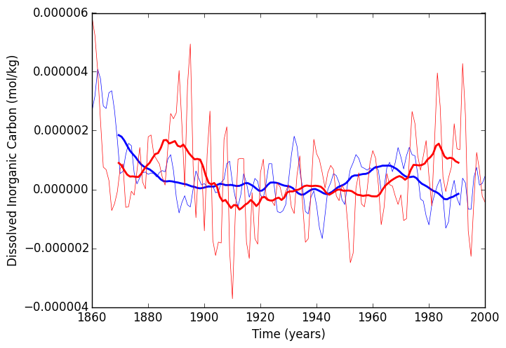
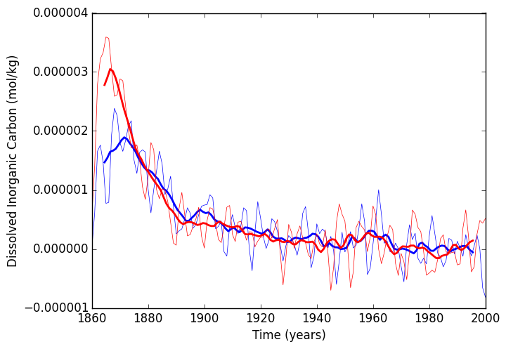
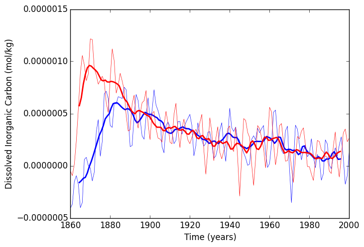

# August 20, 2015

Look at the anthropogenic DIC for two mixing cases (aredi = 400 and aredi = 2400) in multiple locations in the Southern Ocean 

Anthropogenic DIC      | Age
:---------------------------:|:-----------------------:
 |![] (files/DoublingCO2_age_zonalavg_contour_08202015.png)

## Time-series and differentiated time-series for three locations: 

High Latitude Surface: | Mid latitude at 500dbars | Mid latitude at 900dbars
:--------------------:|:-------------------------:|:------------------------:
||
||

