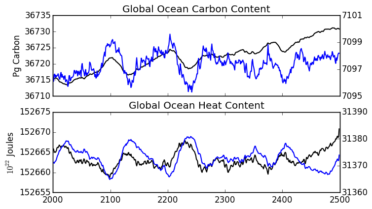
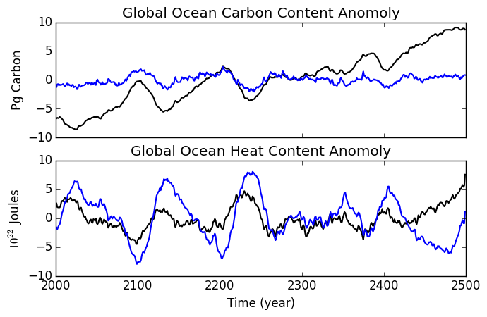

# September 15, 2015

Look at carbon and heat inventories in the newCO2 aredi = 800 CM2Mc model run: 
Calculated ocean carbon and heat content: 

Where the black line represents the entire ocean and the blue line represents the upper 700m.

