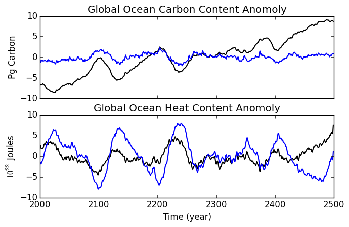
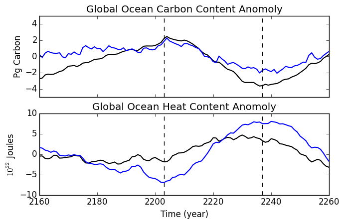
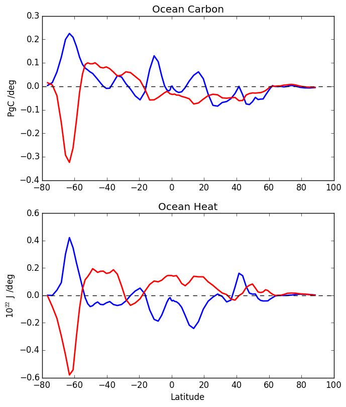
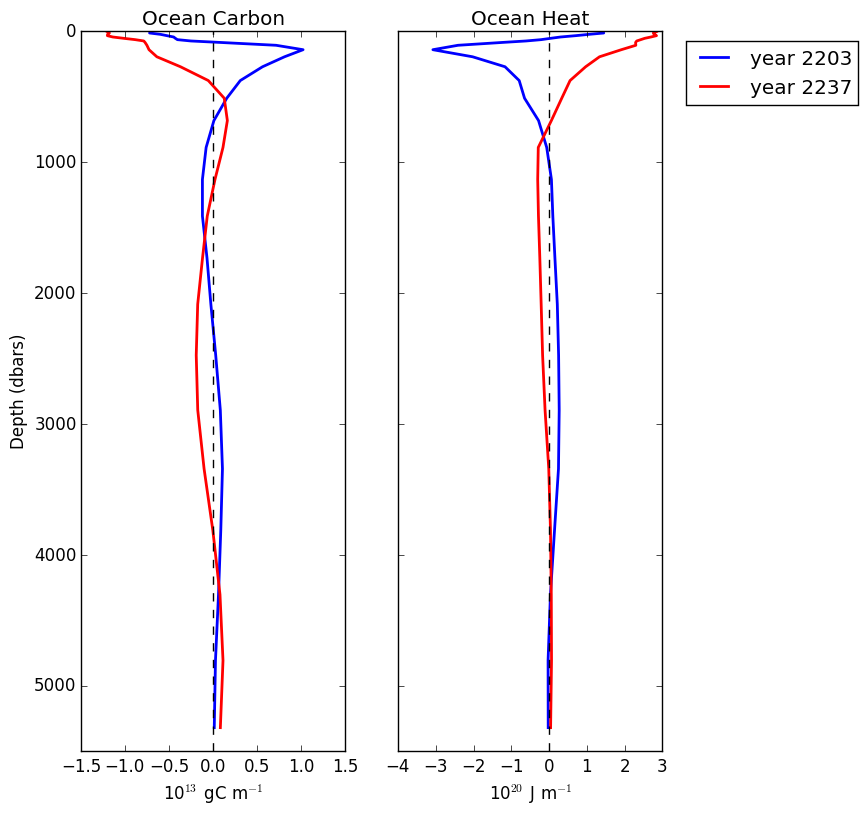
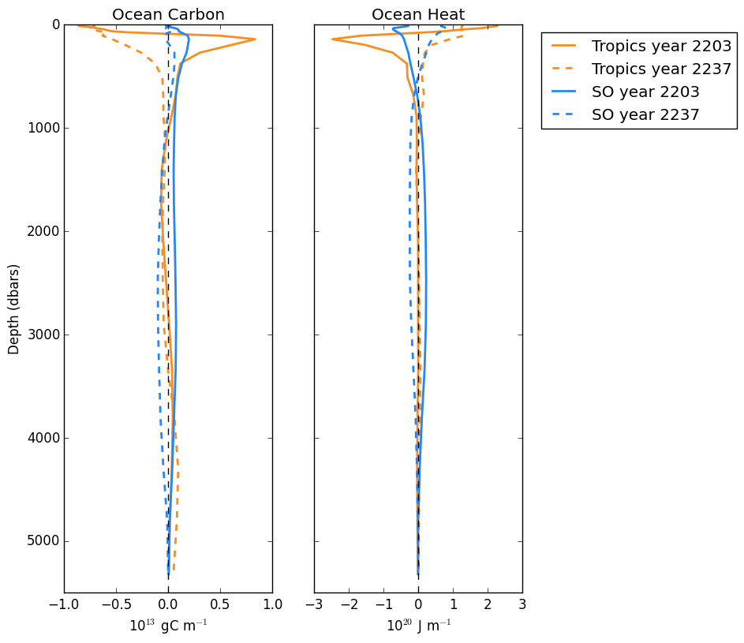
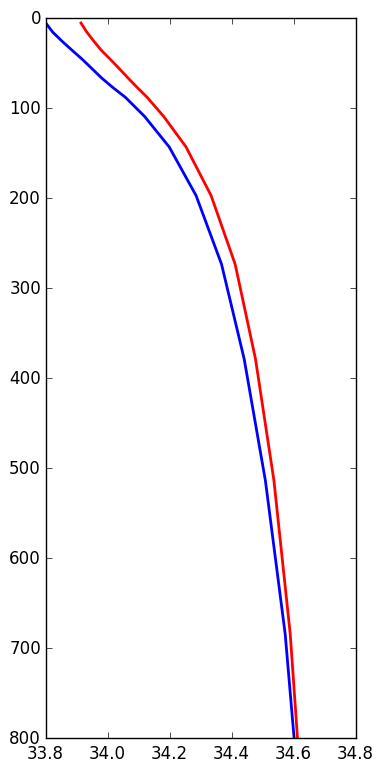
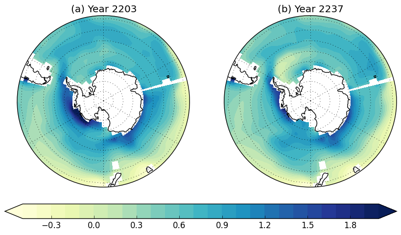
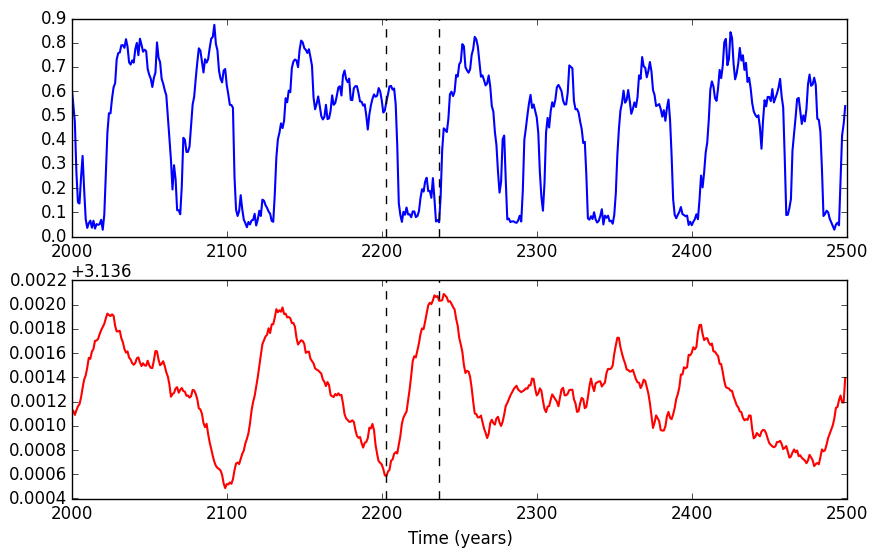
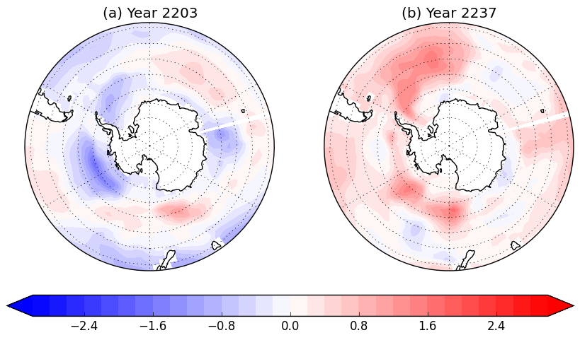

# October 7, 2015

### Heat and carbon timeseries: 

### Heat and carbon variation with depth and latitude
Variations with Latitude | Variations with Depth
:-------------------------:|:-------------------------:
 | 

### Break up into tropics and Southern Ocean
Timeseries | Variations with Depth
:-------------------------:|:-------------------------:
 | 

### Look into the Southern Ocean salinity gradient

### Compare salinity gradient in Weddell sea to global upper ocean heat content

### Look at Sea Surface Temperature

