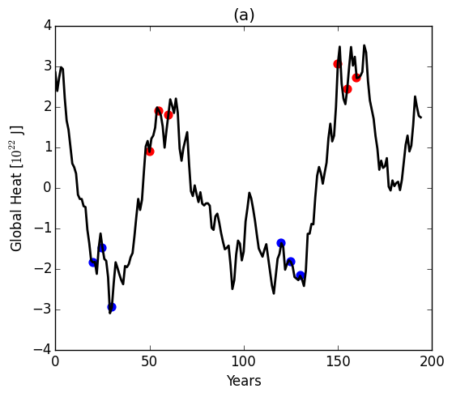
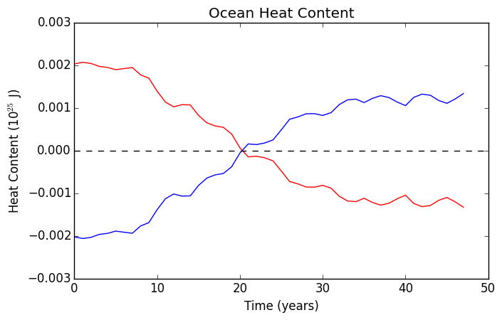

## October 12, 2015

Begin to look at the Green's Function runs done by Will. 

aredi800 SPARC ozone hole run from which Green's Functions were branced off from: 

Plot the global ocean carbon and heat content as a function of time for the ensemble average (black), the ensemble average of the warm start runs (red), and the ensemble averag of the cold start 
runs (blue). Ocean heat content is shown as an anomoly-the heat content minus the time average of the climatology. 

Carbon Content | Heat Content
:-------------------------:|:-------------------------:
 |  

Also plotted the difference of warm and cold start ensemble averages from the total ensemble averages (red line minus black line, ect.)
Carbon Content Anomoly | Heat Content Anomoly
:-------------------------:|:-------------------------:
 | 
