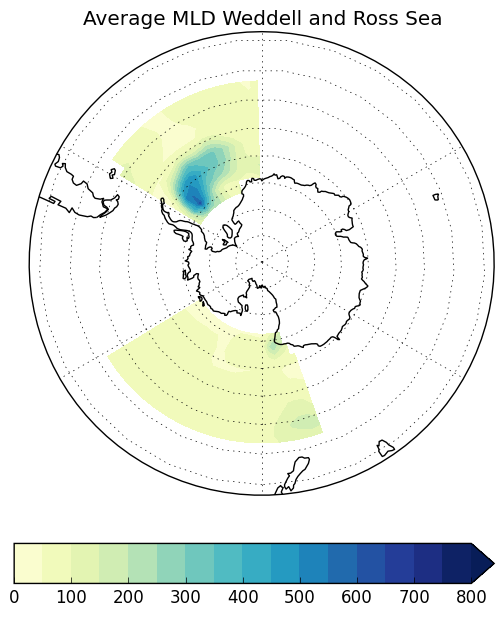
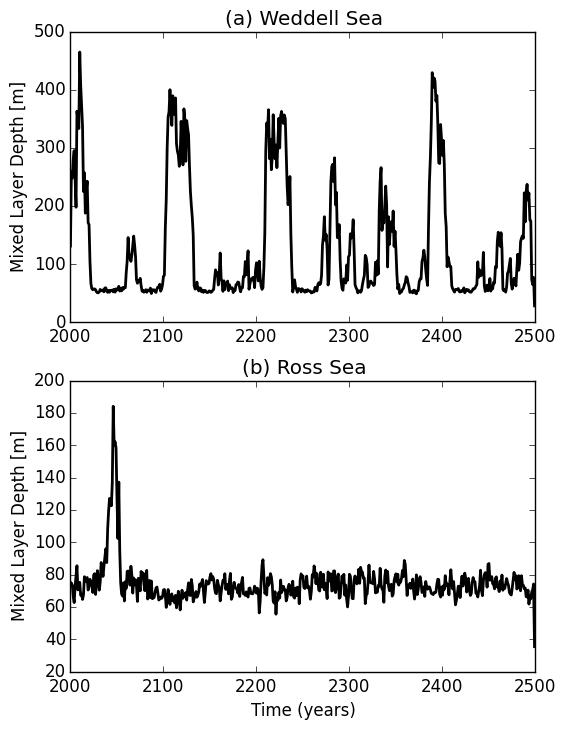
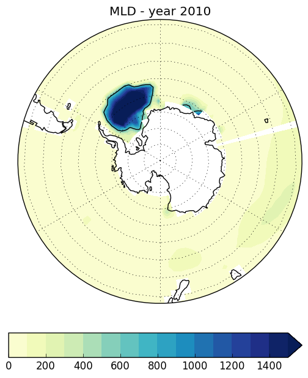
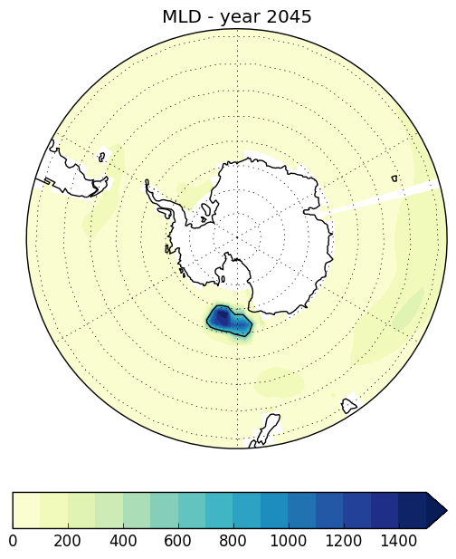
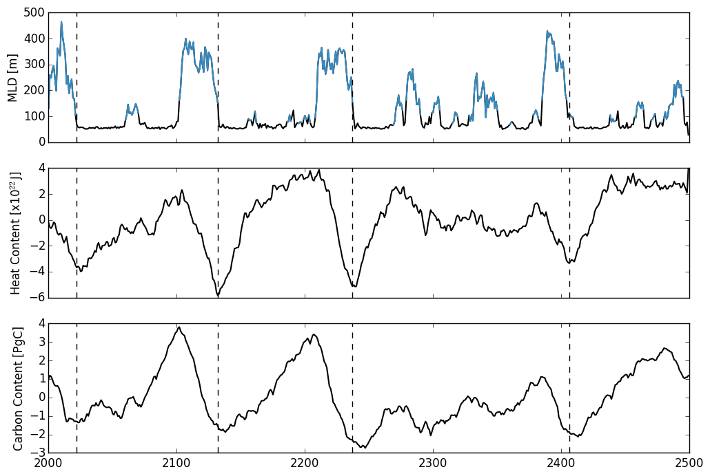
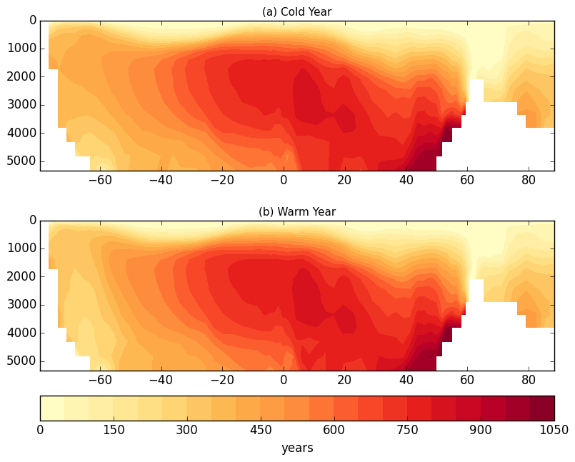
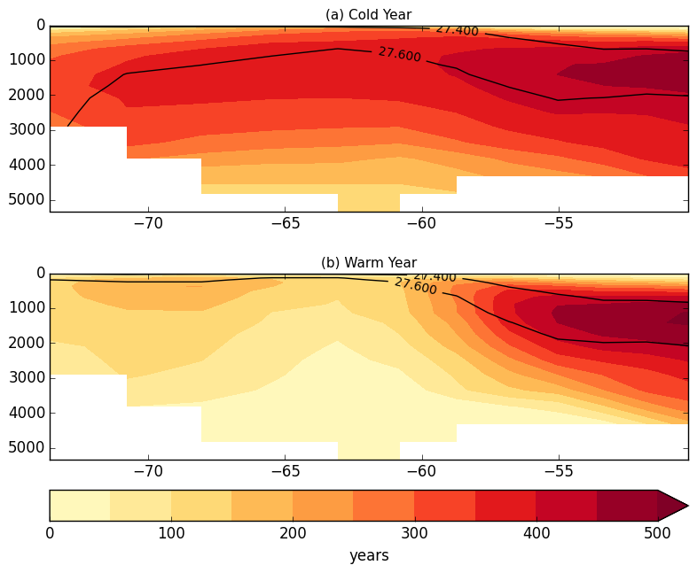
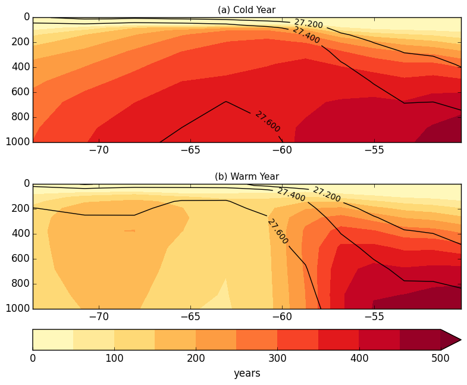

## October 27, 2015

Continued looking at the control run - examine mixed layer depth, convection, and age. 

### Mixed layer depth and convection

Mixed Layer Depth (m) in Weddell Sea (50S-75S, 60W-0W) and Ross Sea (50S-75S, 160E-120W):

Mixed Layer Depth (m) averaged over each region: 

Mixed Layer Depth for Weddell Sea convective year (2010) and Ross Sea convective year (2045)

Weddell Sea Convection | Ross Sea Convection
:-------------------------:|:-------------------------:
 | 

Timeseries of Weddell Sea MLD (convective times shown in blue), Southern Ocean heat content, and 
Southern Ocean carbon content. Convective times defined as when the MLD reaches below 600m and has an 
area greater than 100,000 km^2. 

 

### Age:

Age in Weddell Sea:

Total Water Column | Top 1000 m
:-------------------------:|:-------------------------:
 | 
